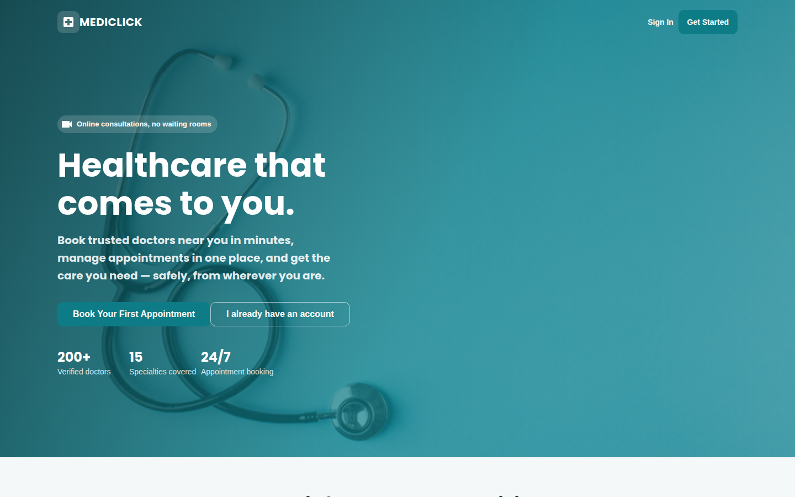
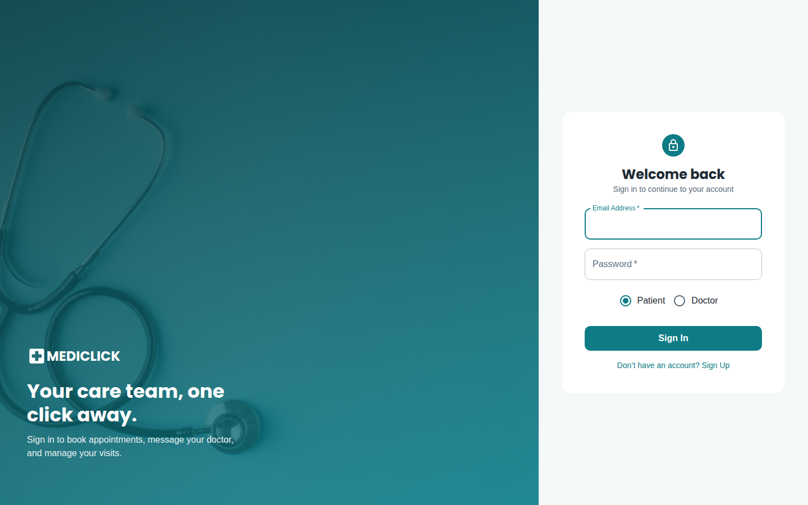
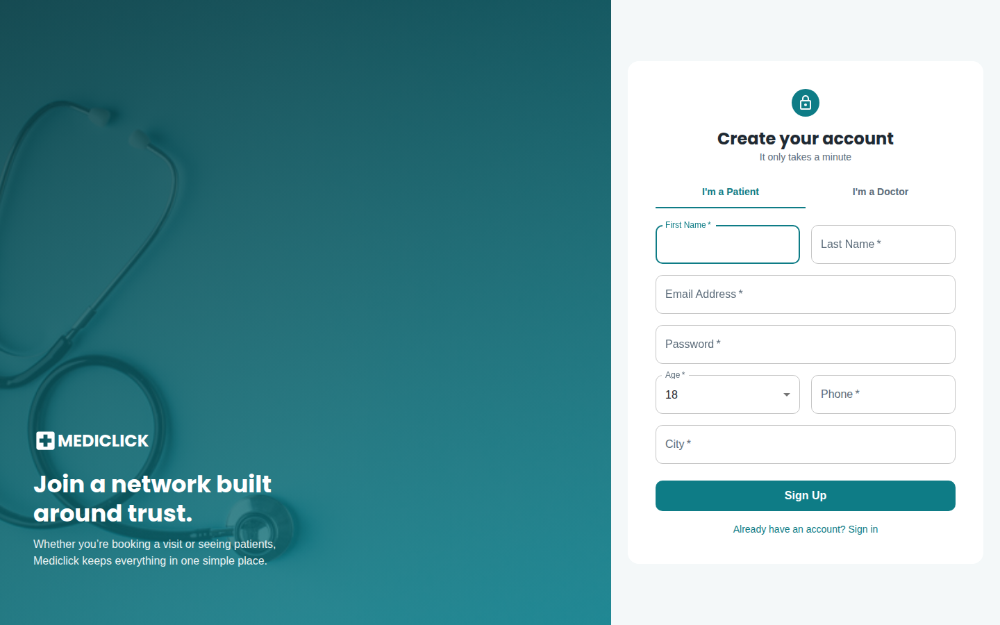
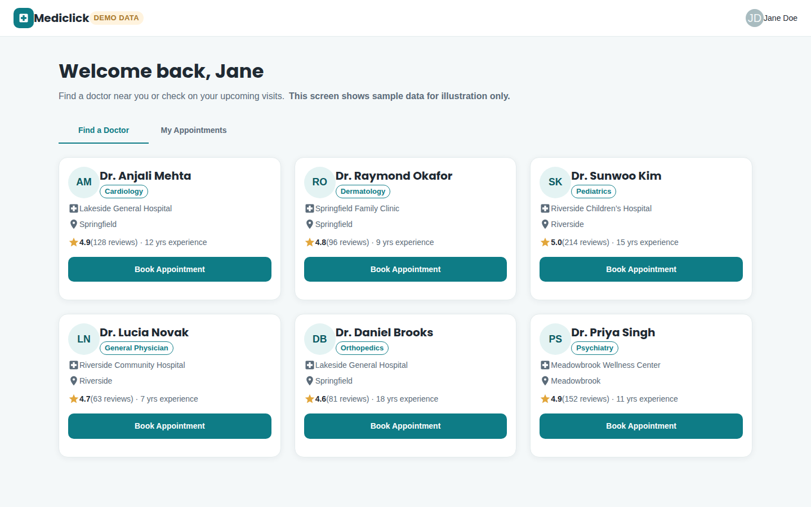

# Mediclick

Mediclick is a web app built during the COVID-19 pandemic that lets patients
book appointments with doctors for online consultations. Patients sign up,
browse doctors by hospital and specialty, and book a time slot; doctors sign
up with their hospital/specialty and manage the appointments booked with
them.

**Live static demo:** <https://vanshika1302.github.io/mediclick/> - see the
[GitHub Pages](#github-pages) section below for what "static demo" means
here and how the deploy is built.

## Screenshots

> **Note:** The client normally gets its data from the Express/MongoDB API
> described below. The screenshots on this page were captured without a
> live database — the landing/sign-in/sign-up pages are the real production
> UI, and the dashboard screenshot is the `/demo` route (see
> [`client/src/components/demo/`](client/src/components/demo)), a
> screenshot-only path that renders the same components against hardcoded
> sample doctors and appointments. **All doctor names, appointments, and
> stats shown below are fictional sample data, not real records.**

**Landing page**



**Sign in**



**Doctor dashboard (sample/demo data)**


**Create account**



**Live on GitHub Pages** (`https://vanshika1302.github.io/mediclick/demo`,
served from the `/docs` folder under the `/mediclick/` subpath - see
[GitHub Pages](#github-pages))



## Architecture

This is a MERN-style app split into two independently run halves:

- **`client/`** - a React 16 single-page app (bootstrapped with Create React
  App 4) using Material-UI v4 for the UI, `react-router-dom` for routing, and
  `axios` to talk to the API.
- **`server/`** - an Express 4 + Mongoose 5 REST API that talks to MongoDB.

```
client/  --axios (HTTP, proxied to :4000 in dev)-->  server/  --mongoose-->  MongoDB
```

In development, `client/package.json` sets `"proxy": "http://localhost:4000/"`
so the React dev server forwards API calls straight to the Express server
without needing CORS configuration on the client side.

## Prerequisites

- Node.js (tested with Node 22; anything reasonably current works, see the
  "Known limitations" note about `NODE_OPTIONS` below)
- A running MongoDB instance (local install, Docker, or a hosted cluster e.g.
  MongoDB Atlas)

## Setup

### 1. Server

```bash
cd server
npm install
cp .env.example .env   # edit MONGO_URL / PORT if needed
npm start               # or: npm run dev (nodemon, auto-restarts on changes)
```

Environment variables (see `server/.env.example`):

| Variable    | Default                                   | Description                          |
|-------------|--------------------------------------------|---------------------------------------|
| `PORT`      | `4000`                                     | Port the Express API listens on       |
| `MONGO_URL` | `mongodb://localhost:27017/mediclick`      | MongoDB connection string             |

If MongoDB isn't reachable at `MONGO_URL`, the server still starts and logs
`Could not connect to database: ...` - it does not crash, but any route that
touches the database will fail until a database is available.

### 2. Client

```bash
cd client
npm install
npm start    # dev server on http://localhost:3000
```

For a production build:

```bash
cd client
npm run build
```

The build output goes to `client/build/` and can be served by any static
file host (or Express, if you wire up `express.static`).

#### Previewing the UI without a database

`client/src/components/demo/` adds a single `/demo` route (wired up in
`App.js`) that renders the dashboard's "find a doctor" / "my appointments"
views against hardcoded sample data in `demo/demoData.js` instead of calling
the real API. It doesn't touch `axios` or any production data-fetching
code, isn't linked from the login/signup flow in development, and exists
purely so the UI can be reviewed/screenshotted with `npm start` and no
MongoDB running - visit `http://localhost:3000/demo` after starting the
client. This is how the dashboard screenshot above was captured.

#### Routing visitors to the demo on a static deploy

The deployed [GitHub Pages](#github-pages) build is served as static files
with no Express/MongoDB API behind it at all, so the real login/sign-up/
booking flow can't function there - submitting the login form, for
instance, would just hang or fail against a URL that doesn't exist. Rather
than let that be the default experience for a visitor, the production
build (`npm run build`, which sets `NODE_ENV=production`) additively
changes two things so people land on something that actually works:

- The landing page's primary call-to-action buttons (`components/Header.js`)
  point at `/demo` instead of `/signup`, with copy that says so upfront.
- `/login` and `/signup` show a dismissable-in-spirit (always-visible, not
  intrusive) banner - `components/DemoBanner.js` - stating plainly that this
  is a static demo build with no live backend, linking to `/demo`.

This is gated by `client/src/config.js`'s `IS_STATIC_BUILD`
(`process.env.NODE_ENV === 'production'`), not a hand-set flag: `server/`
never serves `client/build/` in this repo (no `express.static` wiring), so a
production client build only ever exists for this static deploy, while
`npm start` always talks to a real backend through the dev proxy. Local
development is unaffected either way - the real `axios`-backed code paths
in `Login.js`, `Signup.js`, `NewAppointment.js`, etc. are untouched; only
where the CTAs point and whether the banner renders changes.
`DemoDashboard.js` still renders a `DEMO DATA` badge and an on-screen note
that the data is sample-only, exactly as before.

## GitHub Pages

The client is deployed as a static site at
<https://vanshika1302.github.io/mediclick/>, configured as a GitHub Pages
**project site** serving the `main` branch's `/docs` folder (Settings ->
Pages -> Source: `Deploy from a branch`, Branch: `main` / `docs`).

Two CRA/react-router details matter for a project site served from a
subpath instead of a domain root:

- **`client/package.json` sets `"homepage": "."`.** Without it, CRA emits
  root-absolute asset URLs (`/static/js/...`) that 404 under a subpath like
  `/mediclick/`; `"."` makes every built asset URL relative instead.
- **`Router` in `client/src/App.js` gets an explicit `basename`
  (`/mediclick` in production, via `ROUTER_BASENAME` in
  `client/src/config.js`).** `homepage: "."` deliberately makes
  `process.env.PUBLIC_URL` a subpath-agnostic `"."`, which isn't usable as a
  basename, so it's set separately. Without it, every redirect and
  `<Link>` navigation resolves against the site root and silently drops the
  `/mediclick` prefix - which breaks both in-app navigation and the
  `docs/404.html` fallback below.

**`docs/404.html`** is a copy of `docs/index.html`. This is a static host -
GitHub Pages can't do server-side rewrites for react-router's client-side
routes - so a direct hard load of e.g. `/mediclick/demo` 404s at the HTTP
level. GitHub Pages serves a project's `404.html` for any unmatched path
under that project, and because it's byte-identical to `index.html`, the
same React app boots and its router (now with the correct `basename`) takes
over and renders `/demo` normally.

**Regenerating the deploy:**

```bash
cd client
npm run build                 # NODE_ENV=production is set automatically by CRA
cp -r build/. ../docs/
cp ../docs/index.html ../docs/404.html
```

`docs/.nojekyll` (an empty file already committed) tells GitHub Pages not to
run the build output through Jekyll, which would otherwise ignore/mangle
files and folders starting with `_`.

## API route summary

All routes are mounted on the Express app in `server/index.js`.

| Method | Route                | Description                                   |
|--------|-----------------------|------------------------------------------------|
| POST   | `/login`              | Log in a patient or doctor (`userType` in body)|
| POST   | `/logout`             | Log out (currently a stub - see below)         |
| PUT    | `/patient/register`   | Create a patient account                       |
| GET    | `/patient/read`       | List patients                                  |
| POST   | `/patient/edit`       | Update a patient by email                      |
| DELETE | `/patient/delete`     | Delete a patient                               |
| PUT    | `/doctor/register`    | Create a doctor account                        |
| GET    | `/doctor/read`        | List doctors (with hospital/specialty populated)|
| POST   | `/doctor/edit`        | Update a doctor by email                       |
| DELETE | `/doctor/delete`      | Delete a doctor                                |
| PUT    | `/appointment/create` | Book an appointment                            |
| GET    | `/appointment/read`   | List appointments                              |
| POST   | `/appointment/edit`   | Update an appointment                          |
| DELETE | `/appointment/delete` | Cancel/delete an appointment                   |
| GET    | `/hospital/read`      | List hospitals                                 |
| GET    | `/specialty/read`     | List medical specialties                       |

`/logout` and cookie-based sessions are stubbed out (commented code in
`server/index.js`) - the app currently authenticates per-request rather than
maintaining a server-side session.

## Authentication / password storage

Passwords are hashed with `bcrypt` (10 salt rounds) in a Mongoose `pre('save')`
hook on both the `Patient` and `Doctor` models, so a hash - never plaintext -
is what gets written to MongoDB. `POST /login` uses `bcrypt.compare()` against
the stored hash rather than a plaintext `===`/`!==` check, and the password
hash is stripped out of the login response before it's sent back to the
client.

## Known limitations / follow-up work

These were identified but intentionally **not** addressed in this pass
because each is a larger, riskier change that touches most of the codebase
rather than a config/dependency fix:

- **Mongoose 5 -> 8 upgrade.** The server is pinned to Mongoose 5. Upgrading
  to a current major version requires rewriting every callback-style call
  (`Model.find((error, data) => { ... })`, used throughout `server/routes/*`
  and `server/index.js`) to the promise/async-await API, since callback
  support for query methods was removed in Mongoose 6. This is a mechanical
  but repo-wide change and deserves its own PR with careful testing against a
  real database.
- **React 16 -> 18/19 and Material-UI v4 -> v6 upgrade.** The client is
  pinned to React 16, `react-scripts` 4 (webpack 4), and Material-UI v4
  (`@material-ui/*`, no longer maintained - superseded by MUI v5/v6's
  `@mui/*` packages). Moving off these requires migrating every component
  that imports from `@material-ui/*` to `@mui/material`, updating the
  `withStyles`/`makeStyles` usage to the new styling APIs, and re-testing the
  UI. Also a separate, larger effort.
- **`react-scripts` 4 / webpack 4 needs `NODE_OPTIONS=--openssl-legacy-provider`
  on modern Node.** Node 17+ defaults to OpenSSL 3, which webpack 4's hashing
  code doesn't support, and `client/package.json`'s `start`/`build`/`test`
  scripts set that flag inline so this "just works" on Linux/macOS shells.
  Windows users (or CI on `windows-latest`) would need to set it another way
  (`set NODE_OPTIONS=...` or a `cross-env` wrapper). This goes away once the
  client is migrated to a current `react-scripts`/Vite-based toolchain.
- **`client/package.json` also pins an `overrides` entry for
  `postcss-safe-parser`'s nested `postcss` dependency** to a patched 8.x
  version. Without it, a fresh `npm install` resolves an old, buggy nested
  `postcss@8.1.4` for that one transitive dependency whose `exports` map
  doesn't include `./lib/tokenize`, which breaks `npm run build` under
  modern Node/npm with an `ERR_PACKAGE_PATH_NOT_EXPORTED` error. This is
  purely a toolchain/environment issue (unrelated to any app dependency
  version), also resolved once `react-scripts` is upgraded.
- **No automated tests.** Neither `client/` nor `server/` has real test
  coverage; `npm test` on the client runs CRA's test runner with no
  meaningful test files, and the server's `test` script is a placeholder.
  CI currently only verifies the client builds and the server installs/boots
  cleanly.
- **No server-side session/cookie handling.** `/logout` and the cookie-based
  session logic in `server/index.js` are commented out; the app relies on
  the client remembering login state instead.
- **Editing a user (`POST /patient/edit`, `POST /doctor/edit`) uses
  `updateOne`, which bypasses the password-hashing `pre('save')` hook.** If a
  future edit flow lets a user change their password, that path needs its
  own explicit `bcrypt.hash()` call (or switch to `findOne` + `save()`) so a
  changed password doesn't get stored in plaintext.
- `npm audit` reports vulnerabilities in both `client/` and `server/`, almost
  all of them nested inside `mongoose`'s (v5) MongoDB driver chain and
  `react-scripts`'/Material-UI v4's own dependency trees. These clear up as
  part of the two major-version migrations above; running
  `npm audit fix --force` today would pull in exactly those breaking major
  bumps, which is why it wasn't run in this pass.
